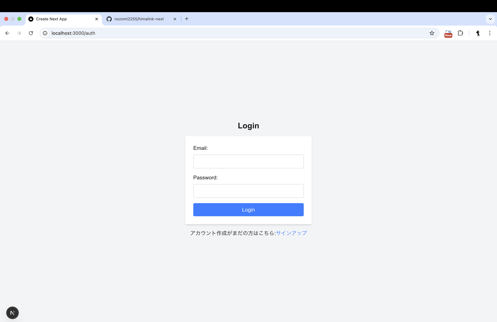
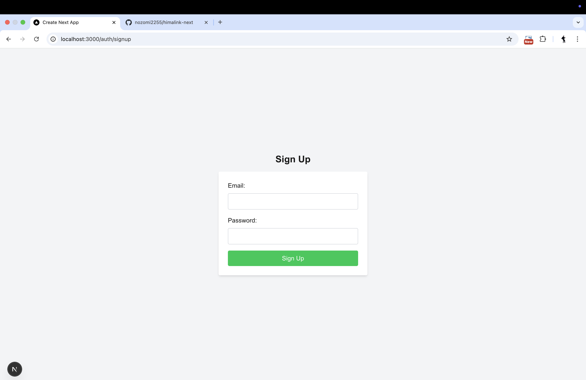
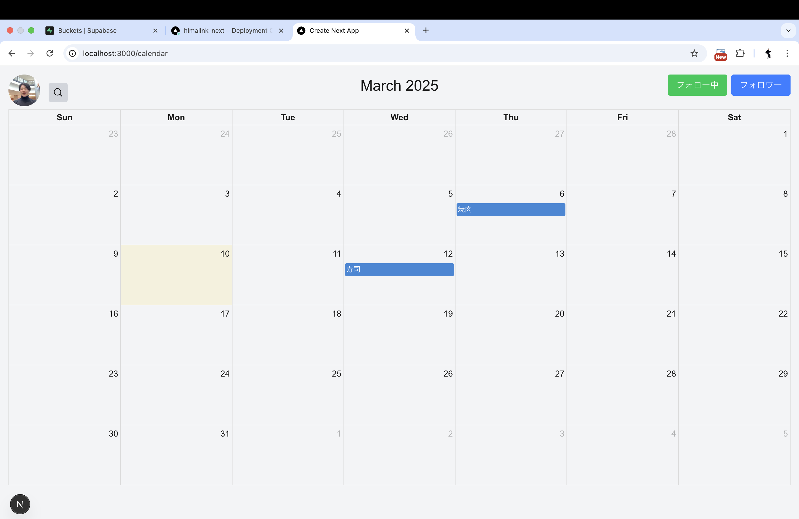
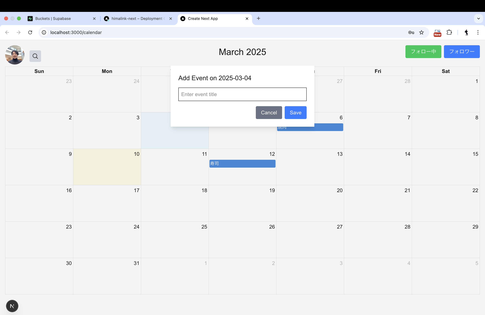
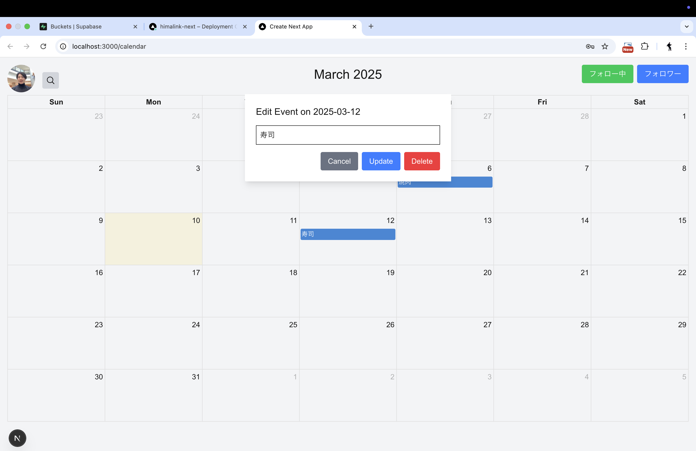
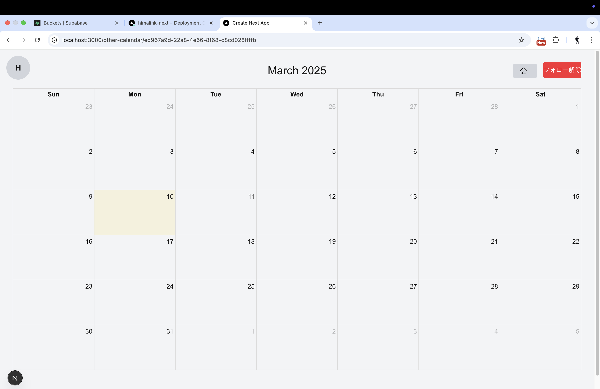
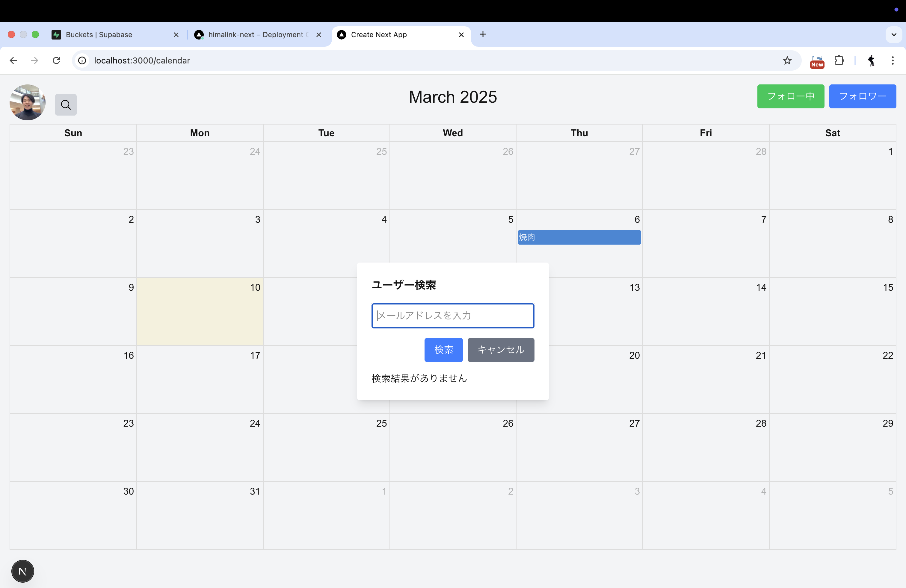
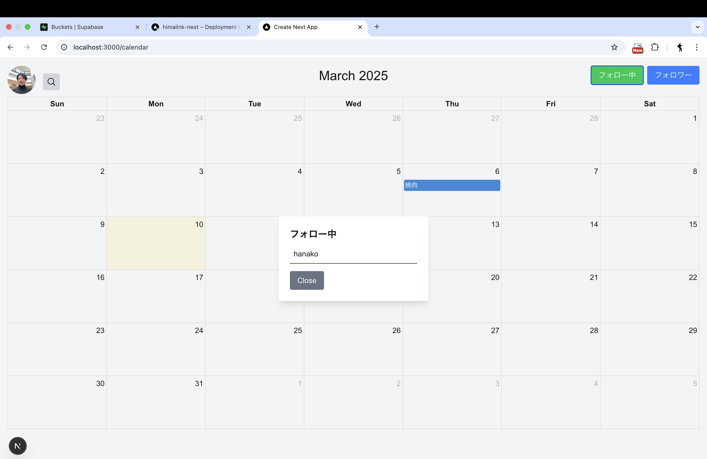
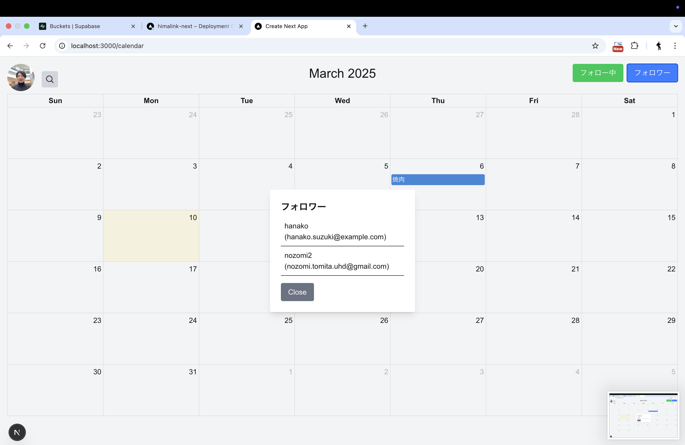
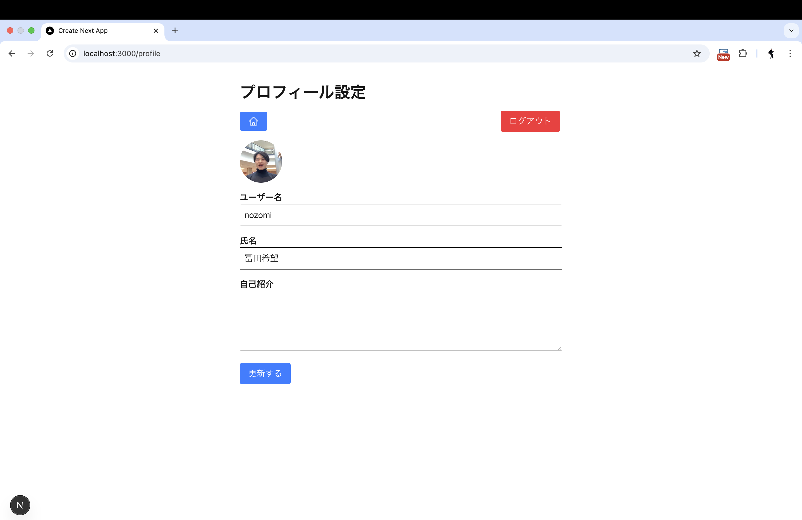

# ひまリンク

ひまリンクは、Next.js と Supabase をベースにした予定管理およびソーシャルスケジューリングアプリです。ユーザーは自分の予定を管理するだけでなく、他のユーザーとカレンダー情報を共有し、フォローや検索を通じてコミュニケーションを図ることができます。

## プロジェクト概要

- **フロントエンド:** Next.js (React)
- **バックエンド:** Supabase (認証、データベース、Storage)
- **UI:** Tailwind CSS を使用した直感的で洗練されたユーザーインターフェイス

### 主要機能

1. **ユーザー認証**  
   Supabaseを使用したログインおよびサインアップ機能  
   認証状況に応じたリダイレクト処理（未認証の場合はログインページへ、自分のデータが取得できた場合はカレンダーページへ）

   
   

2. **カレンダー表示**  
   FullCalendarを利用して、ユーザーの予定を直感的に表示  
   レスポンシブ対応により、デバイスに最適なレイアウトを実現

   

3. **予定の追加**  
   日付とタイトルのみを指定し、デフォルトでは終日イベントとして設定  
   詳細な日時の変更機能は現在未実装

   


4. **予定の編集・削除機能**  
   既存の予定のタイトルのみ編集可能  
   不要な予定は削除可能

   

5. **他ユーザーのカレンダー表示機能**  
   他のユーザーのカレンダー情報を閲覧可能  
   他ユーザーの予定を色分けするなど、視覚的に区別可能な表示を実装

   

6. **他ユーザーの検索・フォロー機能**  
   メールアドレス等で他ユーザーを検索し、該当ユーザーのカレンダーへ遷移可能  
   フォロー／アンフォロー操作を通じて、他ユーザーとの関係性を構築

   

7. **フォロー・フォロワーの表示**  
   フォロー中およびフォロワーの一覧をモーダルで表示  
   各ユーザーの基本情報（ユーザー名、メールなど）を表示

   
   

8. **プロフィール設定機能**  
   プロフィール設定画面への遷移  
   プロフィール画像の追加・編集（Supabase Storage を使用）  
   自分の基本情報（名前、メール、自己紹介など）の編集が可能

   
---

## セットアップ

### 前提条件

- Node.js (推奨バージョン: 16.x 以上)
- npm または yarn

### インストール手順

1. **リポジトリのクローン:**

   ```bash
   git clone https://github.com/yourusername/himalink-next.git
   cd himalink-next
   ```

2. **依存関係のインストール:**

   ```bash
   npm install
   # または
   yarn install
   ```

3. **環境変数の設定:**
   プロジェクトルートに `.env.local` ファイルを作成し、以下のような必要な環境変数を設定します。
   （Supabase の URL と API キー、その他必要な設定を記述）

   ```plaintext
   NEXT_PUBLIC_SUPABASE_URL=https://your-supabase-project.supabase.co
   NEXT_PUBLIC_SUPABASE_ANON_KEY=your-anon-key
   ```

### 開発の開始

ローカル開発サーバーを起動するには、以下のコマンドを実行します：

```bash
npm run dev
# または
yarn dev
```

ブラウザで [http://localhost:3000](http://localhost:3000) を開き、アプリの動作を確認してください。

### ビルドとデプロイ

#### ビルド

本番環境用にビルドするには、以下のコマンドを使用します：

```bash
npm run build
# または
yarn build
```

#### デプロイ

Next.js アプリのデプロイは、Vercel を利用するのが最も簡単です。Vercel の公式サイトからプロジェクトをインポートし、環境変数を設定することで、簡単にデプロイが可能です。詳細は [Next.js のデプロイドキュメント](https://nextjs.org/docs/deployment) を参照してください。

## 使用している技術とバージョン

- **Next.js:** 13.4.4 (最新の安定版として採用)
- **React:** 18.2.0 (Next.jsに同梱されているバージョン)
- **Supabase-js:** 2.2.0 (最新安定版 ※実際のプロジェクトで使用しているバージョンに合わせてください)
- **Tailwind CSS:** 3.2.7 (最新安定版 ※リリース時の最新バージョンに合わせて更新してください)

## プロジェクト構成

/himalink-next
├── app/                    # Next.js のページコンポーネント（例: カレンダーページ、認証ページ、プロフィール設定ページなど）
├── components/             # 再利用可能な React コンポーネント（例: CalendarHeader, CalendarView, EventFormModal, UserAvatar, FollowersModal, FollowingModal など）
├── lib/                    # Supabase クライアントなどのライブラリ設定
├── public/                 # 静的アセット
├── styles/                 # グローバル CSS や Tailwind 設定
├── .env.local              # 環境変数
└── README.md               # このファイル

## 学習リソース

- [Next.js ドキュメント](https://nextjs.org/docs) - Next.js の機能や API について学べます。
- [Supabase ドキュメント](https://supabase.io/docs) - Supabase の認証、データベース、Storage の使い方について説明されています。
- [Tailwind CSS ドキュメント](https://tailwindcss.com/docs) - ユーティリティファーストな CSS フレームワークの詳細が記載されています。

## 貢献

このプロジェクトはまだ初期段階です。フィードバックや貢献を歓迎します！  
バグ報告や機能提案は GitHub の Issue からお願いいたします。

## 今後の予定

- **UI の改善:**  
  ユーザーがより直感的に操作できるよう、レスポンシブデザインやアニメーション、スタイルの統一などを進めます。

- **追加機能:**  
  他ユーザーのカレンダー表示、フォロー／フォロワー機能、プロフィール設定の充実などをさらに強化していく予定です。

---

以上が、ひまリンクプロジェクトの README.md のサンプルです。プロジェクトの概要、セットアップ手順、使用している技術、開発・デプロイ手順、そして今後の予定を網羅しており、プロジェクトに参加する開発者や利用者にとって有用な情報となります。

