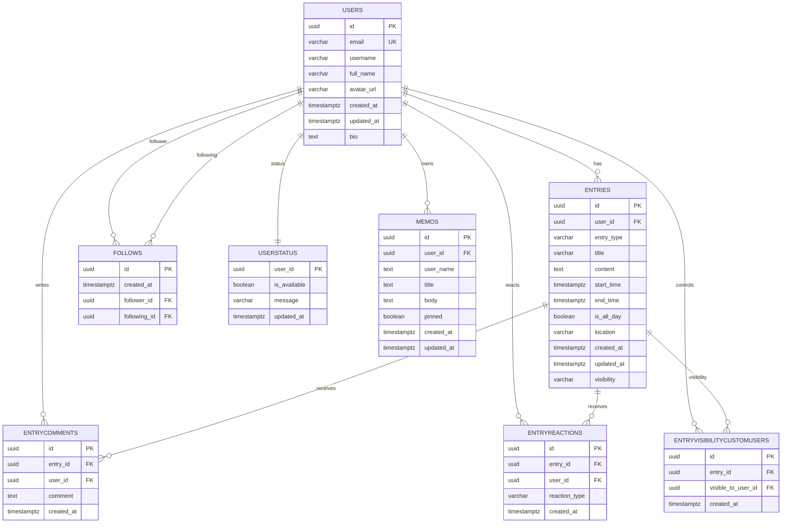

```mermaid
erDiagram
  USERS {
    uuid   id PK
    varchar email UK
    varchar username
    varchar full_name
    varchar avatar_url
    timestamptz created_at
    timestamptz updated_at
    text   bio
  }

  ENTRIES {
    uuid   id PK
    uuid   user_id FK
    varchar entry_type
    varchar title
    text   content
    timestamptz start_time
    timestamptz end_time
    boolean is_all_day
    varchar location
    timestamptz created_at
    timestamptz updated_at
    varchar visibility
  }

  ENTRYCOMMENTS {
    uuid   id PK
    uuid   entry_id FK
    uuid   user_id FK
    text   comment
    timestamptz created_at
  }

  ENTRYREACTIONS {
    uuid   id PK
    uuid   entry_id FK
    uuid   user_id FK
    varchar reaction_type
    timestamptz created_at
  }

  ENTRYVISIBILITYCUSTOMUSERS {
    uuid   id PK
    uuid   entry_id FK
    uuid   visible_to_user_id FK
    timestamptz created_at
  }

  FOLLOWS {
    uuid   id PK
    timestamptz created_at
    uuid   follower_id FK
    uuid   following_id FK
  }

  USERSTATUS {
    uuid   user_id PK
    boolean is_available
    varchar message
    timestamptz updated_at
  }

  MEMOS {
    uuid   id PK
    uuid   user_id FK
    text   user_name
    text   title
    text   body
    boolean pinned
    timestamptz created_at
    timestamptz updated_at
  }

  %% ──────────── Relationships ────────────
  USERS ||--o{ ENTRIES : "has"
  USERS ||--o{ ENTRYCOMMENTS : "writes"
  USERS ||--o{ ENTRYREACTIONS : "reacts"
  USERS ||--o{ ENTRYVISIBILITYCUSTOMUSERS : "controls"
  USERS ||--o{ FOLLOWS : "follower"
  USERS ||--o{ FOLLOWS : "following"
  USERS ||--|| USERSTATUS : "status"
  USERS ||--o{ MEMOS : "owns"

  ENTRIES ||--o{ ENTRYCOMMENTS : "receives"
  ENTRIES ||--o{ ENTRYREACTIONS : "receives"
  ENTRIES ||--o{ ENTRYVISIBILITYCUSTOMUSERS : "visibility"
```

