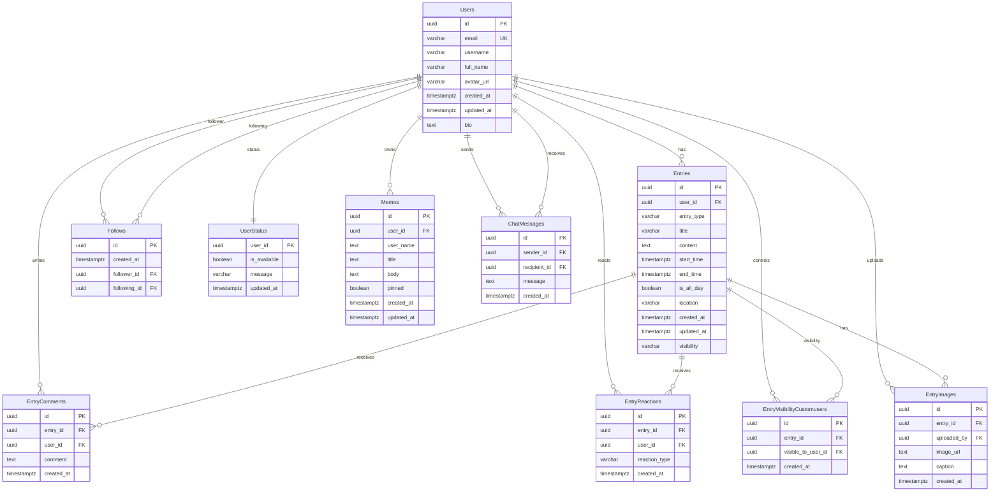

## テーブル設計.md

```mermaid
erDiagram
  EntryImages {
    uuid   id PK
    uuid   entry_id FK
    uuid   uploaded_by FK
    text   image_url
    text   caption
    timestamptz created_at
  }
  Users {
    uuid   id PK
    varchar email UK
    varchar username
    varchar full_name
    varchar avatar_url
    timestamptz created_at
    timestamptz updated_at
    text   bio
  }

  Entries {
    uuid   id PK
    uuid   user_id FK
    varchar entry_type
    varchar title
    text   content
    timestamptz start_time
    timestamptz end_time
    boolean is_all_day
    varchar location
    timestamptz created_at
    timestamptz updated_at
    varchar visibility
  }

  EntryComments {
    uuid   id PK
    uuid   entry_id FK
    uuid   user_id FK
    text   comment
    timestamptz created_at
  }

  EntryReactions {
    uuid   id PK
    uuid   entry_id FK
    uuid   user_id FK
    varchar reaction_type
    timestamptz created_at
  }

  EntryVisibilityCustomusers {
    uuid   id PK
    uuid   entry_id FK
    uuid   visible_to_user_id FK
    timestamptz created_at
  }

  Follows {
    uuid   id PK
    timestamptz created_at
    uuid   follower_id FK
    uuid   following_id FK
  }

  UserStatus {
    uuid   user_id PK
    boolean is_available
    varchar message
    timestamptz updated_at
  }

  Memos {
    uuid   id PK
    uuid   user_id FK
    text   user_name
    text   title
    text   body
    boolean pinned
    timestamptz created_at
    timestamptz updated_at
  }

  ChatMessages {
    uuid   id PK
    uuid   sender_id FK
    uuid   recipient_id FK
    text   message
    timestamptz created_at
  }

  %% ──────────── Relationships ────────────
  Users ||--o{ Entries : "has"
  Users ||--o{ EntryComments : "writes"
  Users ||--o{ EntryReactions : "reacts"
  Users ||--o{ EntryVisibilityCustomusers : "controls"
  Users ||--o{ Follows : "follower"
  Users ||--o{ Follows : "following"
  Users ||--|| UserStatus : "status"
  Users ||--o{ Memos : "owns"
  Users ||--o{ EntryImages : "uploads"
  Users ||--o{ ChatMessages : "sends"
  Users ||--o{ ChatMessages : "receives"

  Entries ||--o{ EntryComments : "receives"
  Entries ||--o{ EntryReactions : "receives"
  Entries ||--o{ EntryVisibilityCustomusers : "visibility"
  Entries ||--o{ EntryImages : "has"
```

