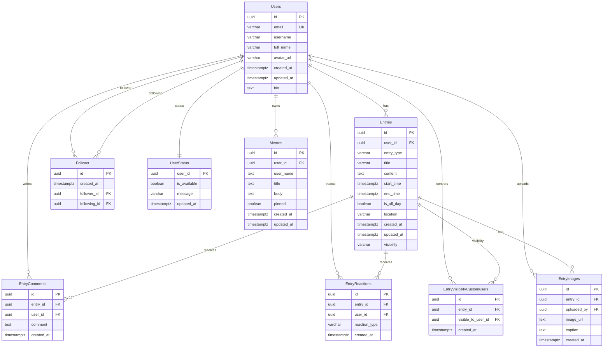

```
-- add_entry_image
create or replace function public.add_entry_image(
  p_entry_id uuid,
  p_image_url text,
  p_caption text default null
)
returns void
language plpgsql
security definer
as $$
begin
  insert into public."EntryImages" (entry_id, uploaded_by, image_url, caption)
  values (
    p_entry_id,
    auth.uid(),
    p_image_url,
    p_caption
  );
end;
$$;
```

```
-- get_entry_images
create or replace function public.get_entry_images(
  p_entry_id uuid
)
returns table (
  id uuid,
  image_url text,
  caption text,
  uploaded_by uuid,
  created_at timestamptz
)
language sql
security definer
as $$
  select
    ei.id,
    ei.image_url,
    ei.caption,
    ei.uploaded_by,
    ei.created_at
  from public."EntryImages" ei
  where ei.entry_id = p_entry_id
  order by ei.created_at asc;
$$;
```